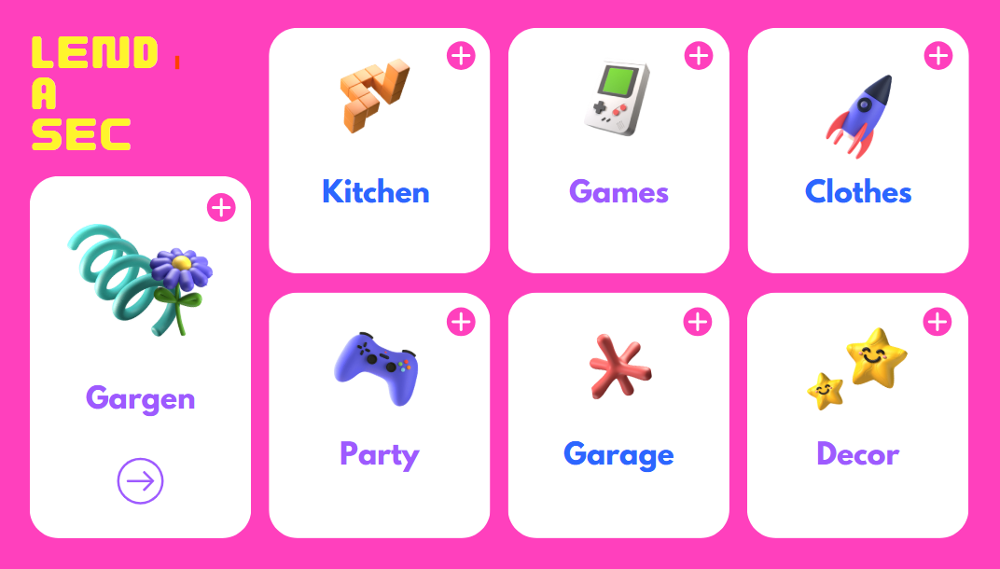

# go-market-place
A platform for local community to lend tools, furniture, and more. 

---

⚙️ Core Tech Stack
- Backend (GoLang)
- Framework: Gin
- Authentication: JWT
- Database: PostgreSQL

---

🛠️ Backend workflow support
- Search Engine: OpenSearch
- File Storage: AWS S3

---

🎨 Frontend
- Framework: React
- Styling: TailwindCSS

---

📱 Mobile
- Kotlin Multi-platform

---

🐳 Deployment & DevOps
- Containerization: Docker 
- Orchestration: Kubernetes
- CI/CD: GitHub Actions
- Monitoring: Prometheus + Grafana

---

🔐 Security & Compliance
- HTTPS via Let's Encrypt
- Data encryption (at rest & in transit)

